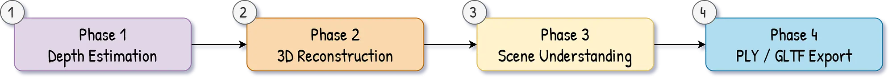

<p align="center">
  <h1 align="center">3D Reconstruction from Video<br>with Depth-Anything-3</h1>
  <p align="center">
    Turn any set of images into 3D point clouds, voxel meshes & Gaussian splats — in a single Python script.
    <br /><br />
    <a href="#quickstart">Quickstart</a>
    &middot;
    <a href="#pipeline">Pipeline</a>
    &middot;
    <a href="#outputs">Outputs</a>
    &middot;
    <a href="#-level-up-your-3d-skills">Go Further</a>
  </p>
</p>

<p align="center">
  
  
  
  
  <a href="https://learngeodata.eu"></a>
</p>

<p align="center">
  
</p>

---

## What This Does

From a handful of overlapping images, this script produces a full 3D reconstruction pipeline — **no COLMAP, no SfM, no LiDAR needed**:

```
 Images (5-20 JPGs)
       │
       ▼
 ┌─────────────────┐     ┌──────────────────┐     ┌──────────────────┐
 │  Depth-Anything-3│────▶│  Dense 3D Point   │────▶│  Ground & Object  │
 │  Depth + Poses   │     │  Cloud (cleaned)  │     │  Segmentation     │
 └─────────────────┘     └──────────────────┘     └──────────────────┘
                                │                          │
                                ▼                          ▼
                    ┌──────────────────┐     ┌──────────────────┐
                    │  Voxel Mesh      │     │  Gaussian Splats  │
                    │  (RGB + Labels)  │     │  + GLB Export     │
                    └──────────────────┘     └──────────────────┘
```

---

## Quickstart

### 1. Clone

```bash
git clone https://github.com/florentpoux/3d-reconstruction-depth-anything.git
cd 3d-reconstruction-depth-anything
```

### 2. Install Depth-Anything-3

```bash
git clone https://github.com/DepthAnything/Depth-Anything-3.git
cd Depth-Anything-3
pip install -e .
cd ..
```

### 3. Install tutorial dependencies

```bash
pip install -r requirements.txt
```

### 4. Add your images

```
data/
└── MY_SCENE/
    ├── 001.jpg
    ├── 002.jpg
    └── ...
```

### 5. Run

Open `da_3d_reconstruction.py`, set your scene name, and run cell-by-cell in VS Code / PyCharm / Spyder:

```python
paths = setup_paths("MY_SCENE")
```

Or run the full script:

```bash
python da_3d_reconstruction.py
```

Results appear in `results/MY_SCENE/`.

---

## Pipeline

| Step | Name | What Happens |
|------|------|-------------|
| 1 | **Load Model** | Initialize DA3 on GPU (CUDA) or CPU |
| 2 | **Load Images** | Scan folder for JPG/PNG frames |
| 3 | **DA3 Inference** | Depth maps + camera poses + confidence — no COLMAP needed |
| 4 | **Depth → 3D** | Back-project pixels to world-space point cloud |
| 5 | **Clean** | Statistical outlier removal (KD-Tree + SOR) |
| 6 | **ROI Crop** | Interactive bounding-box selection (Open3D) |
| 7–8 | **Register** | Multi-frame ICP alignment with translation guards |
| 9 | **Segment Ground** | RANSAC + SVD plane fitting |
| 10 | **Cluster Objects** | Voxel-based connected components (26-neighbor) |
| 11 | **Refine Labels** | KNN majority vote for smooth boundaries |
| 12 | **Voxel Mesh** | Vectorized cube mesh generation (RGB + segmentation) |
| 13 | **GS + GLB** | Gaussian Splatting PLY + browser-ready GLB scene |
| 14 | **Export** | Save PLY, meshes, and NPZ for downstream tasks |

---

## Outputs

All results are saved to `results/<SCENE_NAME>/`:

| File | Description |
|------|-------------|
| `reconstruction.ply` | Point cloud with RGB, segmentation labels, and ground mask |
| `voxel_mesh_rgb.ply` | Colored voxel cube mesh |
| `voxel_mesh_seg.ply` | Segmentation-colored voxel cube mesh |
| `gs_ply/` | Per-view Gaussian Splatting PLY clouds |
| `*.glb` | 3D scene viewable in any browser or 3D viewer |
| `reconstruction_data.npz` | All arrays for downstream workflows |

> **Tip:** Drop `.glb` files into [gltf-viewer.donmccurdy.com](https://gltf-viewer.donmccurdy.com/) for instant 3D viewing. Open `.ply` files in [CloudCompare](https://www.cloudcompare.org/) or MeshLab.

---

## Key Parameters

```python
conf_thresh = 0.4       # Point cloud density (lower = more points, more noise)
nb_neighbors = 20       # Outlier removal neighborhood
std_ratio = 1.0         # Outlier removal strictness (lower = stricter)
n_planes = 2            # Number of ground/wall planes to detect
distance_thresh = 0.01  # RANSAC plane inlier distance (meters)
voxel_size = 0.005      # Clustering resolution (meters)
```

---

## Requirements

- **Python** 3.10+
- **CUDA GPU** recommended (~4 GB VRAM for default model)
- Works on CPU (slower)

---

## Folder Structure

```
.
├── da_3d_reconstruction.py   # Full pipeline — run this
├── requirements.txt          # Python dependencies
├── LICENSE
├── data/                     # Your input images (not tracked)
│   └── MY_SCENE/
└── results/                  # Generated outputs (not tracked)
    └── MY_SCENE/
```

---

## Level Up Your 3D Skills

This tutorial is a **starting point**. Inside the **3D Geodata Academy**, you'll go deeper:

- **Semantic masking** — paint labels on images and fuse them into 3D
- **LiDAR & photogrammetry** — process real-world sensor data at scale
- **Interactive 3D viewers** — build web apps from your reconstructions
- **Production pipelines** — ship 3D data science projects end-to-end

<p align="center">
  <a href="https://learngeodata.eu">
    
  </a>
</p>

<p align="center"><i>Free tutorials, weekly newsletter, and hands-on courses for 3D data scientists.</i></p>

| Resource | Link |
|----------|------|
| 3D Geodata Academy | [learngeodata.eu](https://learngeodata.eu) |
| Newsletter | [learngeodata.eu](https://learngeodata.eu) |
| LinkedIn | [Florent Poux](https://www.linkedin.com/in/florent-poux/) |

---

## Author

**Florent Poux, PhD** — 3D | Point Clouds | Geodata | AI

---

## License

MIT — see [LICENSE](LICENSE).

Depth-Anything-3 is licensed under Apache 2.0 by the [Depth-Anything Team](https://github.com/DepthAnything/Depth-Anything-3).
